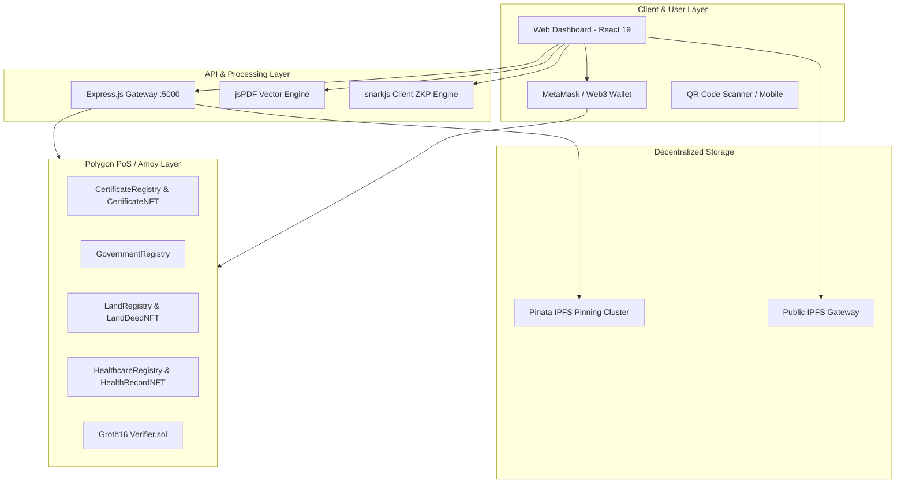
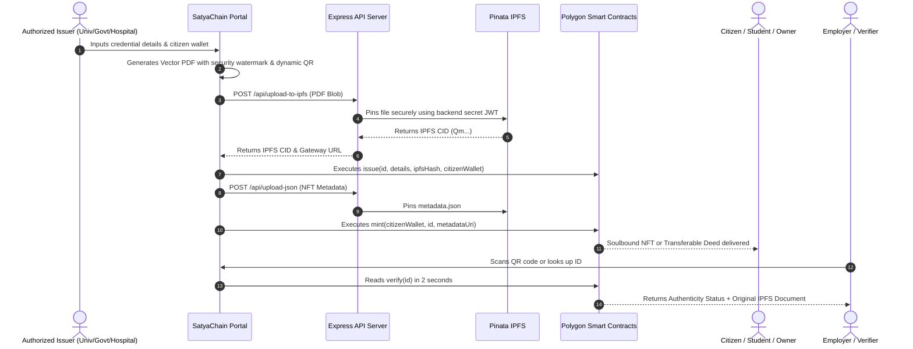

# 🏛️ Satya-Chain: System Architecture & Technical Design

**"India's Decentralized Trust Layer"**

Satya-Chain is an enterprise-grade multi-sector verification platform uniting EVM smart contracts, decentralized IPFS storage, non-fungible tokens (ERC-721 and ERC-5192 Soulbound), and Zero-Knowledge Proofs (ZKP).

---

## 1. High-Level Architecture Diagram

---

## 2. Multi-Sector Data Flow Model

---

## 3. Four Sector Contract Breakdown

### Sector 1: Education (Soulbound Degrees)
- **Contracts:** `CertificateRegistry.sol` & `CertificateNFT.sol`
- **Standard:** ERC-721 + ERC-5192 Soulbound interface
- **Properties:**
  - Non-transferable degree credential (`_update` reverts on transfer).
  - Linked to student's wallet address.
  - Revocation synchronization: When university revokes a fake certificate, the soulbound NFT is permanently burned on-chain.

### Sector 2: Government IDs (National Identity)
- **Contracts:** `GovernmentRegistry.sol` & `Verifier.sol`
- **Standard:** On-Chain Registry + Groth16 ZKP
- **Properties:**
  - $O(1)$ constant-time lookup mapping by citizen wallet.
  - Zero-Knowledge Selective Disclosure: Citizens can prove they are 18+ years old without disclosing their Date of Birth or Aadhaar/PAN number.

### Sector 3: Land & Property (Real Estate Title Deeds)
- **Contracts:** `LandRegistry.sol` & `LandDeedNFT.sol`
- **Standard:** ERC-721 + ERC721Enumerable
- **Properties:**
  - Transferable upon legal property sale.
  - Permanent audit trail: `transferCount` increments automatically on every sale to prevent double-sale and duplicate registries.

### Sector 4: Healthcare (Patient Medical Records)
- **Contracts:** `HealthcareRegistry.sol` & `HealthRecordNFT.sol`
- **Standard:** Soulbound NFT with Custom Doctor Access Control List (ACL)
- **Properties:**
  - Patient owns the NFT.
  - Patient grants temporary read access to attending doctors (`grantAccess`).
  - Patient can revoke doctor access at any time (`revokeAccess`).

---

## 4. Security & Privacy Architecture

1. **Private Key Isolation:** Client-side private keys never touch servers. Transactions are signed directly via MetaMask.
2. **Server-Side Secret Isolation:** Pinata JWT is isolated inside `backend/.env` behind an Express proxy server with rate limiting.
3. **Immutability:** Records once registered cannot be altered. They can only be marked as revoked by the authorized admin, leaving an indelible audit trail.
4. **Zero Knowledge Proofs (ZKP):** Off-chain proof generation via snarkjs with on-chain cryptographic curve verification via EVM precompiles on `Verifier.sol`.
